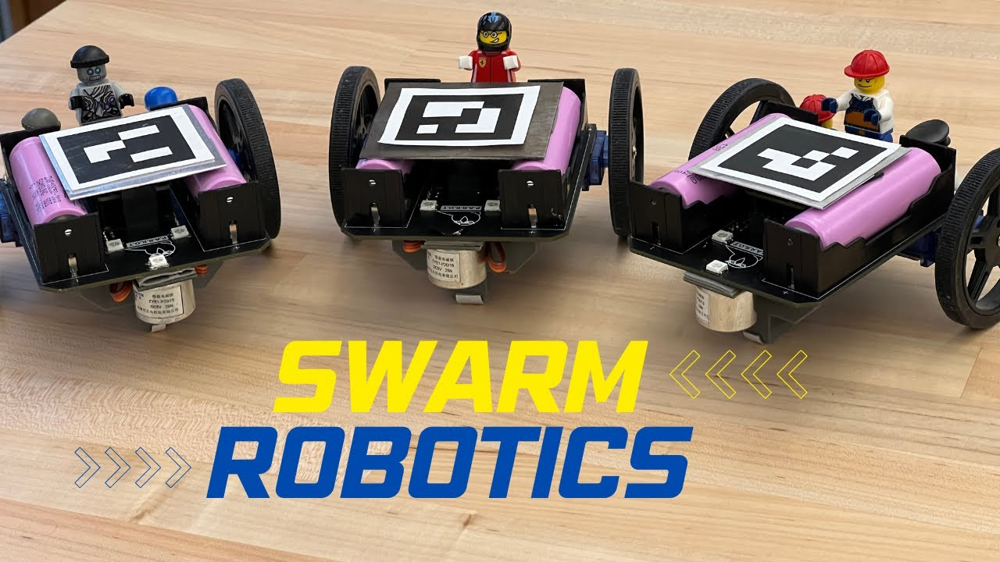

# Swarm Intelligence — Decentralised Multi-Agent Robotics


> ESP32 nodes coordinate over a mesh with no central controller — local rules, emergent behaviour.



---

## The Idea — Think of a Warehouse

Imagine a large warehouse. Thousands of items to sort and arrange. No manager on the floor giving orders — just a fleet of robots, each running the same firmware, each following the same simple rules. No central server. They figure it out together.

This is swarm intelligence. Here are the three key scenarios that make it powerful:

---

### Scenario A — Many independent tasks, many robots → all work in parallel

```
  Tasks:    [ Sort Zone A ]   [ Sort Zone B ]   [ Sort Zone C ]   [ Sort Zone D ]
                  ↓                  ↓                  ↓                  ↓
  Robots:    Robot 1           Robot 2            Robot 3            Robot 4

  Result:   All four zones sorted simultaneously.
            Total time = time of ONE task, not four.
```

Each robot **bids** for an unclaimed task automatically. No one assigns them — they negotiate it among themselves via a distributed auction protocol. The more robots you add, the more tasks complete in parallel.

---

### Scenario B — One heavy task needs all robots → they collaborate

```
  Task: Move a 500 kg pallet  (one robot isn't enough)

       Robot 1 ──▶ ╔══════════════════╗ ◀── Robot 2
       Robot 3 ──▶ ║   500 kg pallet  ║ ◀── Robot 4
                   ╚══════════════════╝
                           ↓
              All push together → pallet moves
              Then they scatter back to individual tasks
```

When a task is too large or complex for one agent, neighbours detect the blocked state via the **shared occupancy grid** (broadcast every 80 ms). All robots converge, synchronise their movement, complete the task together, then disperse — automatically.

---

### Scenario C — One robot's battery dies → the swarm adapts, no human needed

```
  Before:  [ R1 ][ R2 ][ R3 ][ R4 ][ R5 ][ R6 ][ R7 ][ R8 ]
                              ^^^
                          Battery dies mid-task

  After:   [ R1 ][ R2 ][ R3 ]          [ R5 ][ R6 ][ R7 ][ R8 ]
                        R3 covers half ──▶     ◀── R5 covers half
```

Neighbours notice missed broadcasts within **80 ms**. A re-auction triggers automatically — R3 and R5 split the abandoned zone between them. No human intervention. No server to update. The work continues.

---

### The Core Principle

> More robots = faster completion (parallel tasks)
> Harder task = robots converge and collaborate
> Robot fails = neighbours absorb its work automatically

This is what happens in my ESP32 swarm — in a 2×2m arena instead of a warehouse. Same principles. Same emergent intelligence. Each node runs identical firmware; complexity arises from interaction, not from any one robot being smart.

---

## How it Actually Works

Each agent runs a 3-layer control loop:

```
Perception    → [ ultrasonic + IR sensors ]  → local obstacle map
Communication → [ ESP-NOW broadcast, 80ms ]  → shared grid across all nodes
Behaviour     → [ BFS frontier + auction ]   → movement decisions
```

**Frontier exploration** — agents identify unexplored grid cells at the boundary of known space and bid for them based on proximity + battery level.

**Role auction** — when multiple agents target the same cell, they run a 3-round auction. Winner takes the frontier, others redirect. No duplication.

**Collision avoidance** — the shared occupancy grid lets each agent know all peer positions. Path-planning routes around them in real time.

---

## Hardware

| Component | Qty per node |
|-----------|-------------|
| ESP32 DevKit v1 | 1 |
| HC-SR04 Ultrasonic sensor | 3 (front, left, right) |
| IR obstacle sensor | 1 (floor drop detection) |
| L298N motor driver | 1 |
| DC gear motors (200 RPM) | 4 |
| LiPo 3.7V 1000 mAh | 1 |
| Custom PCB (hand-soldered) | 1 |

All PCBs designed in EasyEDA and soldered by hand.

---

## Firmware Architecture

```
firmware/
  ├── main.cpp           Entry point, FreeRTOS task setup
  ├── mesh/
  │   ├── espnow.cpp     Peer discovery + broadcast
  │   └── grid.cpp       Shared occupancy grid (compressed)
  ├── navigation/
  │   ├── bfs.cpp        Frontier BFS planner
  │   └── auction.cpp    Distributed role auction
  └── drivers/
      ├── motors.cpp     PWM motor control
      └── sensors.cpp    Sensor fusion
```

---

## Simulation (Python)

Algorithms were prototyped in a Python grid simulator before burning firmware:

```bash
cd simulation/
pip install -r requirements.txt
python simulate.py --agents 5 --grid 20x20
```

---

## Setup

```bash
git clone https://github.com/kavinjainn/swarm-intelligence
cd swarm-intelligence

# Flash firmware (PlatformIO)
cd firmware/
pio run --target upload

# Or Arduino IDE: open firmware/main/main.ino
```

Dependencies: `ESP-NOW`, `FreeRTOS` (bundled with ESP32 Arduino core).

---

## Results

Five-agent exploration of a 2×2 m bounded arena:
- **~85% grid coverage** before any two nodes visit the same cell
- **47 obstacle avoidance events** in a 3-minute run, zero collisions
- **Re-auction latency** after node failure: <120 ms

Full run video: see `demo/` folder.

---

## About

Built by [Kavin Jain](https://kavinjain.in) — all hardware designed, soldered, and programmed independently.
