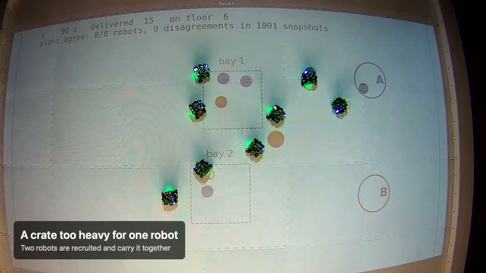

# Swarm Intelligence: warehouse robots without a central brain

Amazon-style warehouse robots (Kiva) need a central planning server and codes stuck all over the floor. That puts them out of reach of a small warehouse. These are cheap ESP32 robots that **pick up parcels and carry them** to the right dock, and that **plan and coordinate on board**. There's no server deciding anything: every robot runs the same planner on the same shared picture, so they agree without negotiating. They split the work, call a partner for a crate too heavy for one, and keep going when a robot dies. A phone above the floor only *sees*.

**▶ Play with it: [kavinjain.in/swarm](https://kavinjain.in/swarm).** The robots' real firmware logic, compiled to WebAssembly and running in your browser.

**▶ On real robots: [70-second video](https://github.com/kavin-jain/swarm-intelligence/releases/download/robotarium-2026-10-08/robotarium-real-run-edited.mp4).** Georgia Tech's Robotarium ran the planner on 8 of its robots: **46 parcels in 300 s**, where 8 runs of its simulator predicted 44. The 8 planners never disagreed (3,029 snapshots), a pair carried the crate, and when one robot's battery "died" mid-run the other 7 carried on. Their robots and arena, our planner, projected parcels ([details](robotarium/README.md)).

[](https://github.com/kavin-jain/swarm-intelligence/releases/download/robotarium-2026-10-08/robotarium-real-run-edited.mp4)

> **Status:** proven in simulation, and the coordination layer has run once on real robots (the Robotarium run above). The robot brain, gateway, camera pipeline and firmware are complete and tested (below). **Carrying needs a gripper.** The physical prototype robots don't have one yet, so their firmware runs in push mode (`GRIPPER_PIN -1`) until one is fitted. Not yet run on our own robots: [Bring-up](#bring-up-on-real-hardware) is the procedure.

---

## What it does

| Situation | What the swarm does |
|---|---|
| 5 parcels, 2 robots | Each robot grips a different parcel and carries it to a free dock slot; the work is split. |
| A parcel against a wall or in a corner | The robot grips it from the open side, backs it off the wall, and turns it round in the open. |
| A crate too heavy for one | The robot that tried feels it won't move and asks for help. Two robots line up side by side, grip one face together, and drive as one wide vehicle. |
| A robot's battery dies | Its gripper lets go. The others stop giving it work, route round it, and pick up its parcel. |
| Two colours, two docks | Each parcel goes to the dock for its colour. |
| A crowded floor | Robots only start a job whose dock has a free slot with a clear approach lane, and only take parcels they can actually get to, so a packed area is cleared from the outside in. |
| Trucks unloading in bursts | It runs the floor like a manager would. Up to 2 robots wait beside a full dock, ready the moment it clears. Idle robots learn where parcels land and wait just outside the busiest bay, clear of where the next parcel will be dropped. Mean wait for pickup −54% (below). |
| More robots than the floor can use | Optional ramp metering (`work_density`): only as many robots work as the floor carries; the rest park. Saves 18–32% energy per parcel on a saturated small floor, but gains no throughput, so it's off by default. |

### How the robots decide (all in [`core/brain.h`](core/brain.h))

1. **Count who's here.** Every robot broadcasts a heartbeat 10× per second over ESP-NOW and counts the ones it hears.
2. **Split the work, with no leader.** Each robot runs the same deterministic allocator on the same snapshot, so they all reach the identical plan without negotiating. This is unit-tested. The allocator also keeps a robot on the parcel it's holding, never over-fills a dock, and skips parcels nobody can reach.
3. **Grip it properly.** A robot lines up, drives straight in slowly, grips, then **tugs**, backing up a few cm: a held parcel follows and a missed one doesn't. Without a gripper sensor, that's how the camera can tell holding from pushing.
4. **Carry without touching anything.** Each robot plans its own route (BFS on a 5 cm grid, re-planned every tick). A held parcel gets the full clearance it can swing through from the walls, and steering guards keep the robot and its parcel off every other parcel.
5. **Recruit when it's heavy.** If the wheels drive but nothing moves, the robot asks for help, the parcel's headcount goes up, and a pair forms. If every robot has tried, the parcel is flagged for a human.
6. **Run the floor.** The same planner applies the manager rules: staging at full docks, learned arrival hotspots, timeouts so a pair never waits forever, and a motor ramp so no wheel starts with a current spike.

The design, every benchmark, and the ideas that were tried and rejected (with numbers) are written up in **[PAPER.md](PAPER.md)**.

## How it's wired


```mermaid
flowchart LR
    CAM["Phone camera<br/>(overhead)"] --> SAT["satellite.py on laptop<br/>ArUco → mm; parcels by tag (colour fallback)"]
    SAT -- "USB serial<br/>camera frame" --> GW["Gateway ESP32<br/>core/world.h"]
    GW -- "ESP-NOW broadcast<br/>shared snapshot, 15 Hz" --> R1["Robot 1<br/>core/brain.h"] & R2["Robot 2"] & R3["Robot 3"]
    R1 & R2 & R3 -- "heartbeats 10 Hz<br/>(state, job, help, neighbours)" --> GW
    R1 -. "heartbeats = discovery" .- R2
```

- **Sees:** `satellite/` reads ArUco markers at the arena corners, which give a homography from pixels to millimetres, plus one marker on each robot for position and heading. Parcels wear a 50 mm ArUco lid tag (`--markers` prints them): the tag id is the parcel, `parcel_tags` maps it to a dock, and the tag height is corrected for parallax. These are read in the same detection pass as the robots, with no colour tuning. Untagged parcels are still found by colour (`colour_loads`), sized and tracked.
- **Relays:** the gateway ESP32 merges camera frames and heartbeats into one snapshot. It decides nothing.
- **Decides:** every robot. The same `core/` headers compile into the firmware, the unit tests, the simulator and the website, so what's tested is what runs.
- **Fails to stopped:** no snapshot for 0.5 s, an e-stop, or low battery, and the motors cut out. A held parcel stays held.

## Tested

`bash run_all.sh` runs everything; CI runs it on every push. Benchmarks run on GitHub's Linux runners (`sim/cloud.sh`), never the laptop. The simulator uses the real wire format, physics with camera noise (3 mm / ~1°), motor mismatch (±8%), radio loss, 80 ms camera lag and a 5% gripper miss rate. Carry and push are compared on the same seeds, with docks shipping parcels after 5 s in both modes.

Measured 2026-10-07 on the current code, on GitHub's Linux runners (ubuntu-24.04). Every failure is classified (`--classify`) and was traced to its cause. Fixing them, then breaking carrier deadlocks by preemption, took the same 1,380 runs from **97.3% (v2) to 99.35%** (McNemar p = 8 × 10⁻⁷; PAPER.md §7):

| Benchmark | Carry (gripper) | Push (no gripper) |
|---|---|---|
| 8 scenarios × 60 seeds | **480/480** | 462/480 |
| 500 random floors | **498/500** | 468/500 |
| 200 floors with loads right against the walls | **200/200** | 118/200 |
| 200 dense floors (6–10 robots, 10–14 loads, 2 docks) | **193/200** (5 with robots touching but every load delivered, 1 gridlock, 1 crate flagged) | 15/200, 42,992 collision events |
| Robot–robot collisions, seeded runs | **0** | 2 |
| Loads scraped along a wall, seeded runs | **0** | not re-measured |
| Hard motor starts (wheel jumps > 25%), seeded runs | **0** | 0 |
| Energy per delivered load (model) | **19.9 mWh** (dense: ≈ 40) | 28.9 mWh (dense: 124) |

**Shift benchmark** (`build/sim --inbound 40`): forty ten-minute shifts of Poisson truck arrivals at 2–3 receiving bays, with the same trucks for every variant. "Manager off" means no staging and no hotspot learning.

| Floor | Manager | Mean wait for pickup | p90 wait | mWh/parcel | Collisions |
|---|---|---|---|---|---|
| 1.5 × 1 m, 2–5 robots | off → **on** | 14.8 → **7.5 s (−49%)** | 33.7 → **13.2 s** | 22.3 → 22.0 | 0 |
| 3 × 2 m, 2–5 robots | off → **on** | 10.0 → **8.7 s (−13%)** | 17.9 → **15.8 s** | 32.3 → 31.5 | 0 |

**Capacity** (saturated floor, 24 shifts per point): see [PAPER.md](PAPER.md) Table 3. In short, the 3 × 2 m floor reaches 1,502 parcels/h with 10 robots, 68% of ten times one robot's rate (93% at 4 robots), with zero collisions, and the 1.5 × 1 m floor tops out near 780–815/h from 4 robots on. On the small floor the limit is how fast bays unload and docks clear, not the robots.

| Other checks | Result |
|---|---|
| Core unit tests (ASan + UBSan): wire format, allocation, leaderless consensus, delivery/recruit/stuck, docks, safety stop, motor ramp, learned waiting spot, ramp metering, pair face, lane blockers, reopened deliveries, deadlock broken by preemption | 19/19 |
| Satellite (Python): bytes match the C++ side; synthetic tilted-camera frames: position, heading, parcel size, colour → dock, parcel tags; `kpi.py` against hand-made and simulator logs | 13/13 · ≤ 1.3 mm · 0.4° |
| Firmware: `robot1-3`, `gateway`, `motortest` for ESP32 DevKit | builds clean |
| WebAssembly: same engine in the browser carries the 5-parcel, heavy-crate and sorting jobs | 83 KB, passes |

The energy figures come from a model, not a meter: electronics 0.5 W, TT motors ~2.5 W each, L298N ~25% loss, gripper 3 W to grab and 1 W to hold. They're for comparison until calibrated on the real robots.

## Hardware

Per robot: **ESP32 DevKit v1**, **L298N or L293D** driver, 2 DC gear motors, 2×18650, and an ArUco marker on top (top edge of the marker = robot's front). For carry mode, a **gripper** on the front: an electromagnet (e.g. ZYE1-P20/15, 12 V, 25 N) switched by a logic-level MOSFET with a flyback diode, with a steel washer on each parcel. Set `GRIPPER_PIN` in `robot_config.h`. The firmware drives it peak-and-hold: full power to grab, ~35% to hold. Also needed: one spare ESP32 as the gateway, a phone as the overhead camera, and a laptop.

| Signal | GPIO | | Signal | GPIO |
|---|---|---|---|---|
| Left EN (PWM) | 14 | | Right EN (PWM) | 32 |
| Left IN1 / IN2 | 27 / 26 | | Right IN1 / IN2 | 25 / 33 |
| Status LED | 2 | | Battery sense (optional) | any of 32–39, via divider |

All in [`firmware/include/robot_config.h`](firmware/include/robot_config.h). Those pins avoid the ESP32 flash pins (6–11), the input-only pins (34–39) and the boot-strapping pins. Battery sense must be on **ADC1**, because ADC2 stops working while the radio is on.

## Bring-up on real hardware

1. **Markers:** `cd satellite && ../.venv/bin/python satellite.py --markers markers/`, then print at 100% scale. Corners 0→1→2→3 go **counter-clockwise seen from above** (the satellite refuses a mirrored layout). Robot *N* wears marker `10+N`.
2. **Wiring check:** `cd firmware && pio run -e motortest -t upload`. Watch each wheel; set `INVERT_L/R` if one spins backwards, and `PWM_MIN` from the ramp.
3. **Calibrate:** with `motortest` running in the arena, run `python satellite.py --measure 1`. Paste the printed `CAL_VMAX` and `CAL_WHEEL_BASE` into `robot_config.h`.
4. **Flash:** `pio run -e robot1 -t upload` (then `robot2`, `robot3`) and `pio run -e gateway -t upload` for the ESP32 on the laptop.
5. **Run:** put the phone above the arena (Continuity Camera on a Mac shows up as camera 0/1), then run `python satellite.py`. Space bar = e-stop all.

6. **Score the run:** `python satellite.py --log run.csv`, then `python kpi.py run.csv`. It computes the simulator's KPIs from camera geometry alone (delivered %, collisions, wall scraping, parcels/h, wait for pickup, arrival → dock), so a real run and a simulated one (`build/sim --inbound 1 --log sim.csv`) compare like for like. The protocol: 10 timed trials per scenario layout, giving a sim-vs-real table.

Things to measure and set in `satellite/config.json`: arena size, camera height and marker height (for parallax correction), and the `docks` list. Each dock has a position, radius and the HSV colour range of the loads it receives (up to 3 docks; keep each one ≥ 11 cm clear of the walls, see Known limits).

## Roadmap

Status as of 2026-10-07. ✅ done · 🔨 in progress · ⬜ next

| # | Upgrade | Why it matters in a real warehouse | Status |
|---|---|---|---|
| 1 | Run on the physical robots | Proof. Everything else is a model until then | ⬜ needs hardware time |
| 2 | Carry instead of push (gripper) | Walls and corners stop mattering; how real warehouse robots work. Done 2026-10-06 in software and simulation, incl. two-robot carries; needs a gripper fitted to test for real | ✅ software · ⬜ hardware |
| 3 | Motion prediction between camera frames (+ wheel encoders/IMU) | Tested in the simulator 2026-10-05: **no gain for pushing robots.** On the 20-seed set, commanded-wheel prediction: 137/140; simulated encoders: 128–138/140 vs 140/140 baseline. Higher speed loses loads; latency isn't the bottleneck. Revisit after #2 (lift), when carried loads can't be lost | ⏸ parked, evidence |
| 4a | Sort by colour to several docks | Real warehouses sort. Done 2026-10-05: up to 3 docks, colour from the camera, 59/60 seeds in the two-dock scenario | ✅ |
| 4b | Traffic at scale | Admission control and reachability-first allocation (2026-10-06); every failure classified and its cause fixed, and carrier deadlocks broken by preemption (2026-10-07): dense floors 193/200. Left: occasional touches between carriers on crowded floors | ✅ mostly |
| 4c | Plan the next 2–3 pickups | Chaining cuts empty travel | ⬜ |
| 5 | Scale past one camera: on-robot localisation + an orders API | Any floor size; a warehouse system can hand the swarm real work | ⬜ design |
| 6 | Battery-aware jobs + charging dock | Robots that run all day: low robots take short jobs, then charge themselves | ⬜ |
| 7 | Live digital twin: the real floor streamed to the website | Anyone can watch the real warehouse working, live | ⬜ needs #1 |
| 8 | Safety zones: stop near hands/people the camera sees | Robots that can share a floor with humans | ⬜ |
| 9 | Self-diagnosis: a robot notices its own stuck wheel or slipping motor | Flags itself for maintenance instead of silently slowing the floor | ⬜ |
| 10 | Throughput and energy KPIs | What a warehouse manager actually buys: parcels/h, wait for pickup, energy per parcel, scaling efficiency, in the simulator and from real camera logs (`kpi.py`) | ✅ |
| 11 | Priority/express orders | Urgent parcels first, like real fulfilment | ⬜ |
| 12 | Learn from experience | Done in part: robots learn where parcels arrive and wait there (−13% wait on a 6 m² floor). Next: each robot's real speed, each load's real difficulty | 🔨 |
| 13 | Floor manager | Staging at full docks, learned hotspots, pair timeouts: −54% wait for pickup. Ramp metering (park surplus robots) built, off by default until parked robots keep to the walls | ✅ · 🔨 metering |

## Repo layout

```
PAPER.md    design, benchmarks, findings and rejected ideas, with references
.github/    check.yml: run_all.sh on every push · bench.yml: paired benchmarks (sim/cloud.sh starts one; sim/stats.py compares) · run.yml: one simulator run, with a backtrace if it hangs
core/       proto.h (wire format) · world.h (gateway bookkeeping) · brain.h (robot logic)
firmware/   PlatformIO: robot, gateway, motortest
satellite/  camera → arena coordinates, serial link, calibration, run logging + kpi.py scoring, tests
sim/        engine.h (physics, camera and radio around the real brain) + scenarios
web/        WebAssembly build of the engine for the website (bash web/build.sh, needs zig)
test/       core unit tests
run_all.sh  every check
```

## Known limits

- **One camera.** The overhead phone is still the one shared sensor, and its view limits the floor size. The fix is on-robot localisation (roadmap #5); the decisions are already on the robots.
- **Dense floors.** 7 of 200 dense floors fail. In 5, every load arrives but two robots touch, always one of them carrying a load. 1 gridlocks, and 1 crate is flagged for a person. Dock lanes must be kept clear (nothing stored within 40 cm of a dock), as in any warehouse.
- **Don't drop parcels next to a robot.** Parcels dropped close around a robot can box it in for good: 120 mm robots can't pass 80 mm gaps. The benchmarks assume nobody drops a parcel within 30 cm of a robot. On a real floor that needs a light at each bay, driven by the camera, which already knows where every robot is. See PAPER.md §5.
- **Small floors fill up.** On 1.5 × 1 m, throughput stops growing after about 4 robots (the bays and docks are the limit); extra robots only cost energy.
- **Push mode (no gripper)** keeps its old limits: loads against walls get stuck (66% success with loads at the walls), and docks need ~11 cm clear behind them.
- **Sim ≠ floor.** Loads are modelled as discs; real pencils roll and pivot. Expect to tune `push_speed`, `stall_ms` and `PWM_MIN` on the real robots.
- **Parallax.** Robot markers sit above the floor, and the correction assumes a near-overhead camera. Tilt the phone as little as possible.
- **One real run, on someone else's robots.** The Robotarium run tests the coordination with projected parcels and the Robotarium's collision avoidance. Gripping, the camera pipeline and the radio are tested only in simulation so far.
- **Packet size.** One snapshot carries up to 10 robots, 16 loads and 3 docks (≤ 250-byte ESP-NOW packet).

---

Built by [Kavin Jain](https://kavinjain.in).
