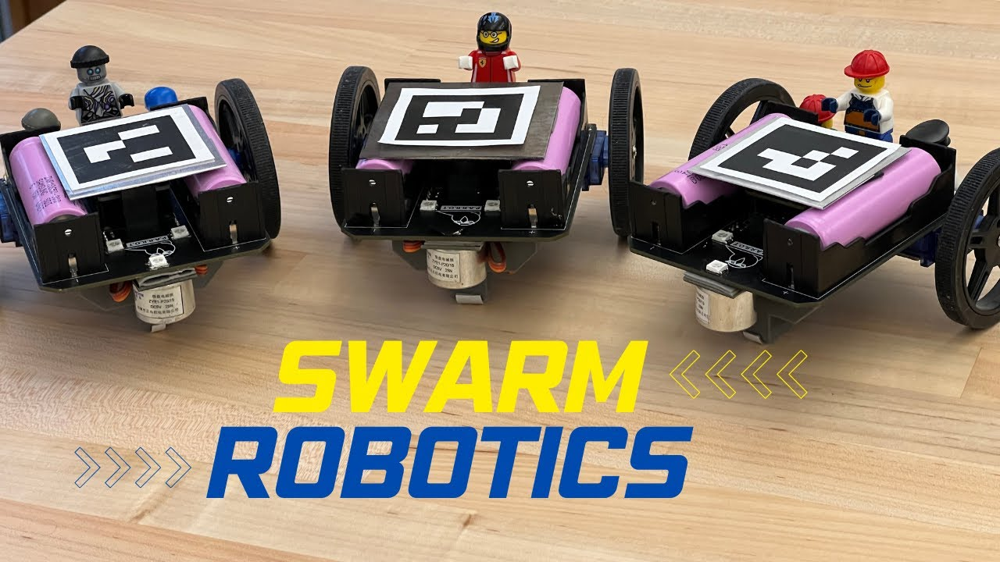
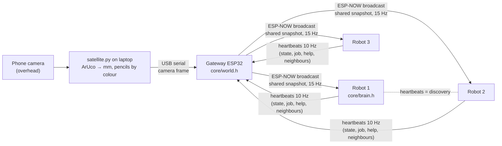

# Swarm Intelligence: robots that split work like ants

ESP32 robots that count how many of them are nearby, divide up a job between themselves, and call for help when a load is too heavy for one. A phone above the arena only *sees*; every decision runs on the robots.



**▶ Play with it: [kavinjain.in/swarm](https://kavinjain.in/swarm).** The robots' real firmware logic, compiled to WebAssembly and running in your browser. Drop parcels, add robots, switch one off, and watch the swarm re-plan.

> **Status:** the firmware, gateway, camera pipeline and simulator are complete and tested (below). It has **not yet been run on the physical robots**. That's the next step, and [Bring-up](#bring-up-on-real-hardware) is the procedure.

---

## What it does

The job: transport pencils (or a heavier box) into a drop zone.

| Situation | What the swarm does |
|---|---|
| 5 pencils, 2 robots | Each robot takes a different pencil; when one is delivered it takes the next. |
| 1 pencil, 2 robots | Both line up side by side and push it together. |
| A load one robot can't move | The robot notices it isn't moving, raises the load's headcount, and a second robot comes to help. |
| A robot's battery dies | It stops getting work; the others absorb its jobs. |
| No robot can move a load | It's marked **stuck** instead of being shoved forever, and re-opens when another robot switches on. |

### The four rules (all in [`core/brain.h`](core/brain.h))

1. **Count who's here.** Every robot broadcasts a heartbeat 10× per second over ESP-NOW and counts the ones it hears. At power-on it blinks that count on its LED.
2. **Split the work, with no leader.** Each robot runs the same deterministic allocator on the same world snapshot, so they all reach the identical plan without a negotiation round. That property is unit-tested. A job needing *k* robots only starts once *k* are free. Spare robots help a 1-robot load, at most 2 per load (that's how many fit behind it).
3. **Recruit when it's heavy.** Weight isn't known in advance. A robot that pushes for 2.5 s without the load moving reports a stall, the load's headcount goes up, and the swarm re-plans. This is the same recruitment ants use.
4. **Give up honestly.** If every live robot has tried, the load is flagged stuck. It re-opens when more robots come online, or when it's moved.

Each robot also plans its own path (BFS on a 5 cm grid, re-planned every tick round loads, robots and walls), lines up behind its load, waits for teammates, and pushes it toward the zone.

## How it's wired


```mermaid
flowchart LR
    CAM["Phone camera<br/>(overhead)"] --> SAT["satellite.py on laptop<br/>ArUco → mm, pencils by colour"]
    SAT -- "USB serial<br/>camera frame" --> GW["Gateway ESP32<br/>core/world.h"]
    GW -- "ESP-NOW broadcast<br/>shared snapshot, 15 Hz" --> R1["Robot 1<br/>core/brain.h"] & R2["Robot 2"] & R3["Robot 3"]
    R1 & R2 & R3 -- "heartbeats 10 Hz<br/>(state, job, help, neighbours)" --> GW
    R1 -. "heartbeats = discovery" .- R2
```

- **Sees:** `satellite/` reads ArUco markers at the arena corners, which give a homography from pixels to millimetres, plus one marker on each robot for position and heading. Pencils are found by colour on a top-down warp, with robots masked out, and tracked so they keep their IDs.
- **Relays:** the gateway ESP32 merges camera frames and robot heartbeats into one snapshot: who's alive, where things are, each load's headcount and status. It decides nothing.
- **Decides:** every robot. The same `core/` headers compile into the firmware, the unit tests and the simulator, so what's tested is what runs.
- **Fails to stopped:** no snapshot for 0.5 s, an e-stop from the laptop (space bar), or low battery, and the motors cut out.

## Tested

`bash run_all.sh` runs everything below.

| Test | What has to hold | Result |
|---|---|---|
| Core unit tests (ASan + UBSan) | Wire format and framing, allocation rules, leaderless consensus (same plan on every robot, in any order), gateway delivery/recruit/stuck logic, safety stop, discovery | 11/11 |
| 7 simulator scenarios × 20 seeds | Everything delivered, work split, help recruited, zero robot-robot collisions. Seeds vary camera noise (3 mm / ~1°), motor mismatch (±8%), and radio loss | **140/140** |
| 500 random arenas | 2–4 robots, 3–8 loads, sometimes a heavy box, loads ≥ 16 cm from walls. All delivered, zero collisions | **488/500** (97.6%) |
| Satellite (Python) | Bytes match the C++ side; on synthetic tilted-camera frames, robot position / heading and pencil position error | 8/8 · ≤ 1.3 mm · 0.4° · 2.8 mm |
| Firmware | `robot1-3`, `gateway`, `motortest` build for ESP32 DevKit | builds clean, 20% RAM |
| WebAssembly build | Same engine in the browser solves the 5-parcel and heavy-crate jobs | 56 KB, passes |

The simulator uses the real wire format: snapshots are encoded and decoded through `core/proto.h` on the way to each simulated robot.

## Hardware

Per robot: **ESP32 DevKit v1**, **L298N or L293D** driver, 2 DC gear motors, 2×18650, and an ArUco marker on top (top edge of the marker = robot's front). Also needed: one spare ESP32 as the gateway, a phone as the overhead camera, and a laptop.

| Signal | GPIO | | Signal | GPIO |
|---|---|---|---|---|
| Left EN (PWM) | 14 | | Right EN (PWM) | 32 |
| Left IN1 / IN2 | 27 / 26 | | Right IN1 / IN2 | 25 / 33 |
| Status LED | 2 | | Battery sense (optional) | any of 32–39, via divider |

All in [`firmware/include/robot_config.h`](firmware/include/robot_config.h). Those pins avoid the ESP32 flash pins (6–11), the input-only pins (34–39) and the boot-strapping pins. Battery sense must be on **ADC1**, because ADC2 stops working while the radio is on.

## Bring-up on real hardware

1. **Markers:** `cd satellite && ../.venv/bin/python satellite.py --markers markers/`, then print at 100% scale. Corners 0→1→2→3 go **counter-clockwise seen from above** (the satellite refuses a mirrored layout). Robot *N* wears marker `10+N`.
2. **Wiring check:** `cd firmware && pio run -e motortest -t upload`. Watch each wheel; set `INVERT_L/R` if one spins backwards, and `PWM_MIN` from the ramp.
3. **Calibrate:** with `motortest` running in the arena, run `python satellite.py --measure 1`. Paste the printed `CAL_VMAX` and `CAL_WHEEL_BASE` into `robot_config.h`.
4. **Flash:** `pio run -e robot1 -t upload` (then `robot2`, `robot3`) and `pio run -e gateway -t upload` for the ESP32 on the laptop.
5. **Run:** put the phone above the arena (Continuity Camera on a Mac shows up as camera 0/1), then run `python satellite.py`. Space bar = e-stop all.

Things to measure and set in `satellite/config.json`: arena size, drop zone, camera height and marker height (for parallax correction), and the pencils' colour range.

## Repo layout

```
core/       proto.h (wire format) · world.h (gateway bookkeeping) · brain.h (robot logic)
firmware/   PlatformIO: robot, gateway, motortest
satellite/  camera → arena coordinates, serial link, calibration, tests
sim/        engine.h (physics, camera and radio around the real brain) + scenarios
web/        WebAssembly build of the engine for the website (bash web/build.sh, needs zig)
test/       core unit tests
run_all.sh  every check
```

## Known limits

- **Walls and corners.** A load pushed flat against a wall can't be got behind. The swarm flags it stuck for a human. That's 8 of the 12 random-arena misses. Keep loads ≥ 16 cm from the walls; with loads right against them, success drops to 62%.
- **Sim ≠ floor.** Loads are modelled as discs; real pencils roll and pivot. Expect to tune `push_speed`, `stall_ms` and `PWM_MIN` on the real robots.
- **Parallax.** Robot markers sit above the floor, and the correction assumes a near-overhead camera. Tilt the phone as little as possible.
- **Packet size.** One snapshot carries up to 12 robots and 16 loads (≤ 250-byte ESP-NOW packet).

---

Built by [Kavin Jain](https://kavinjain.in).
